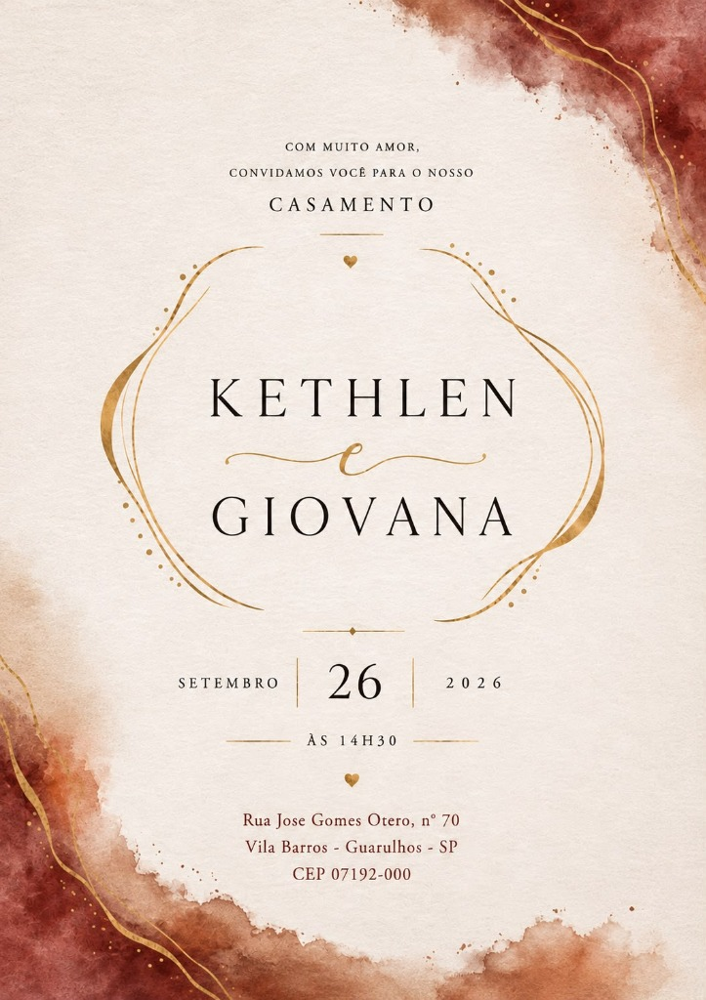
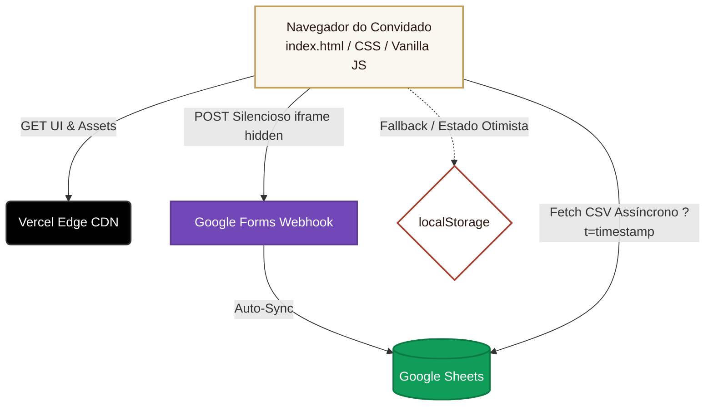

<div align="center">
  
  
  # Site de Casamento — Kethlen & Giovana 💍

  *Um site de casamento elegante, rápido e inovador, construído com arquitetura estática leve e banco de dados serverless (Google Sheets) para sincronização de presentes em tempo real.*

  [](#)
  [](#)
  [](#)
  [](#)
  [](#)
  [](#)
</div>

<br/>

## 📖 Índice

- [Visão Geral](#-visão-geral)
- [✨ Funcionalidades](#-funcionalidades)
- [🏗 Arquitetura do Sistema](#-arquitetura-do-sistema)
- [🎨 Design System](#-design-system)
- [🚀 Como Publicar na Vercel](#-como-publicar-na-vercel)
- [📊 Configurando o Banco de Dados (Google Forms/Sheets)](#-configurando-o-banco-de-dados-google-formssheets)
- [🛠️ Testes e Reset Local](#️-testes-e-reset-local)

---

## 🎯 Visão Geral

Desenvolvido para centralizar as informações do casamento de Kethlen e Giovana (26 de Setembro de 2026). O projeto apresenta uma identidade visual fiel ao convite físico (tons de aquarela marsala, vinho e terracota) e oferece uma experiência de usuário (UX) focada em acessibilidade, velocidade e encantamento.

> [!NOTE]
> 🤖 **Vibe Coding & AI-Driven Development:** Este projeto foi totalmente concebido e orquestrado através do paradigma de **Vibe Coding**, utilizando inteligência artificial avançada (agentes de coding) para arquitetar a solução serverless, gerar componentes visuais fluidos e garantir as melhores práticas de Clean Code, demonstrando proficiência no uso de IA para entregar valor rápido e escalável.

Em vez de depender de sistemas robustos de backend ou plataformas de terceiros pagas, o site emprega uma solução **"Serverless Zero Cost"**, utilizando a API nativa do navegador para sincronizar a lista de presentes diretamente com o **Google Forms e Google Sheets**.

---

## ✨ Funcionalidades

- **Contagem Regressiva:** Timer inteligente e preciso rodando em tempo real até a data da cerimônia.
- **RSVP via WhatsApp:** Botão com direcionamento automático contendo mensagem pré-formatada.
- **Lista de Presentes Dinâmica Otimista:**
  - 22 itens físicos mapeados em cards interativos.
  - Renderização otimista (UI atualizada via `localStorage` antes mesmo da confirmação do servidor) para máxima percepção de performance.
  - Sincronização e ocultação em tempo real de itens já escolhidos através de integração via `fetch` assíncrono com CSV.
- **Sessão Lua de Mel (PIX):** QR Code dinâmico e cópia de chave com apenas um clique para presentes em dinheiro.
- **Integração com Google Maps:** Rotas e visualização do local da cerimônia integrados de forma nativa e através de iframe interativo.

---

## 🏗 Arquitetura do Sistema

O projeto adota uma arquitetura estática SPA (Single Page Application) em arquivo único, focada em resiliência e degradação suave. **Não há dependências do Node.js, Webpack ou banco de dados relacional.**



- **Padrão Anti-CORS:** Submissões são feitas em um iframe invisível para contornar políticas de bloqueio (CORS) entre o navegador e o Google Forms, evitando redirecionamentos de página indesejados e mantendo o fluxo natural do usuário.
- **Sincronização:** Leitura periódica assíncrona do CSV da planilha (ignorando cache com timestamp) para remover dinamicamente da interface itens já reivindicados.

---

## 🎨 Design System

Paleta baseada em aquarela quente e detalhes nobres. Tipografia combinando Serifas Clássicas (`Cormorant Garamond`, `Playfair Display`) com Script (`Alex Brush`) e Legibilidade moderna (`Montserrat`).

| Cor | Hexadecimal | Demonstração | Uso Principal |
|---|---|:---:|---|
| **Marsala Profundo** | `#701C24` | 🔴 | Títulos, botões primários e destaques |
| **Terracota Queimada** | `#A84334` | 🟠 | Gradientes e transições quentes da aquarela |
| **Dourado Nobre** | `#C5A059` | 🟡 | Molduras, ícones, caligrafia, ornamentos |
| **Marfim Quente** | `#FAF6F0` | ⚪ | Fundo principal (textura de linho) |
| **Marrom Café** | `#2C1810` | 🟤 | Tipografia base (parágrafos e textos longos) |

---

## 🚀 Como Publicar na Vercel

Por ser uma aplicação totalmente estática, o deploy leva segundos.

1. Faça o clone do repositório ou envie-o para seu próprio GitHub:
```bash
git clone https://github.com/SEU_USUARIO/SEU_REPOSITORIO.git
cd site_casamento_gk
git push -u origin main
```
2. Acesse [Vercel](https://vercel.com) e conecte com sua conta GitHub.
3. Clique em **Add New... > Project** e importe este repositório.
4. Em *Framework Preset*, certifique-se de que está como **Other** e clique em **Deploy**.
5. Seu site estará online, protegido por SSL e distribuído via CDN global instantaneamente.

---

## 📊 Configurando o Banco de Dados (Google Forms/Sheets)

O site armazena presenças e presentes na nuvem através do ecossistema Google. Para conectá-lo à sua conta:

### Passo 1: Criar e Mapear o Forms
1. Crie um formulário no [Google Forms](https://forms.google.com) com 4 perguntas de Texto: **Presente**, **Nome Completo**, **Mensagem para as Noivas** e **Valor PIX**.
2. Vá na aba "Respostas" e crie uma planilha do **Google Sheets**.
3. Na planilha, vá em *Arquivo > Compartilhar > Publicar na Web*. Escolha a aba desejada e formato **CSV**. Guarde este link seguro.

### Passo 2: Obter os IDs de Submissão (`entry.XXXX`)
1. No Forms, clique em **Gerar link preenchido previamente** e preencha com palavras de teste.
2. Copie o link final, e anote os números dos campos (ex: `entry.123456789`).

### Passo 3: Conectar no `index.html`
Vá na configuração do objeto `GOOGLE_FORMS_CONFIG` (próximo da linha `680`) no `index.html`:

```javascript
const GOOGLE_FORMS_CONFIG = {
  // Troque final da URL de 'viewform' para 'formResponse'
  formUrl: "https://docs.google.com/forms/d/e/SUA_CHAVE/formResponse",
  // Cole a URL do CSV Público da planilha gerada
  sheetsCsvUrl: "https://docs.google.com/spreadsheets/d/e/SUA_CHAVE/pub?output=csv",
  entries: {
    presente: "entry.123456789",
    nome: "entry.987654321",
    mensagem: "entry.555555555",
    valor: "entry.111111111"
  }
};
```

---

## 🛠️ Testes e Reset Local

Para simular o fluxo de presentes sem travar sua máquina ou sujar a base de produção, foi implementado um mecanismo seguro baseado em *LocalStorage*.
Para limpar os dados do seu navegador e reativar todos os presentes na interface local:

- Role até o final da página e clique no botão discreto **`↻ Restaurar Lista de Presentes`**.
- Alternativamente, abra o DevTools do navegador (F12) > Application > Local Storage > e apague a chave `casamento_gk_presentes`.

---
<div align="center">
  <sub>Feito com ❤️ para o grande dia. ✦ Sua presença é o nosso maior presente. ✦</sub>
</div>
